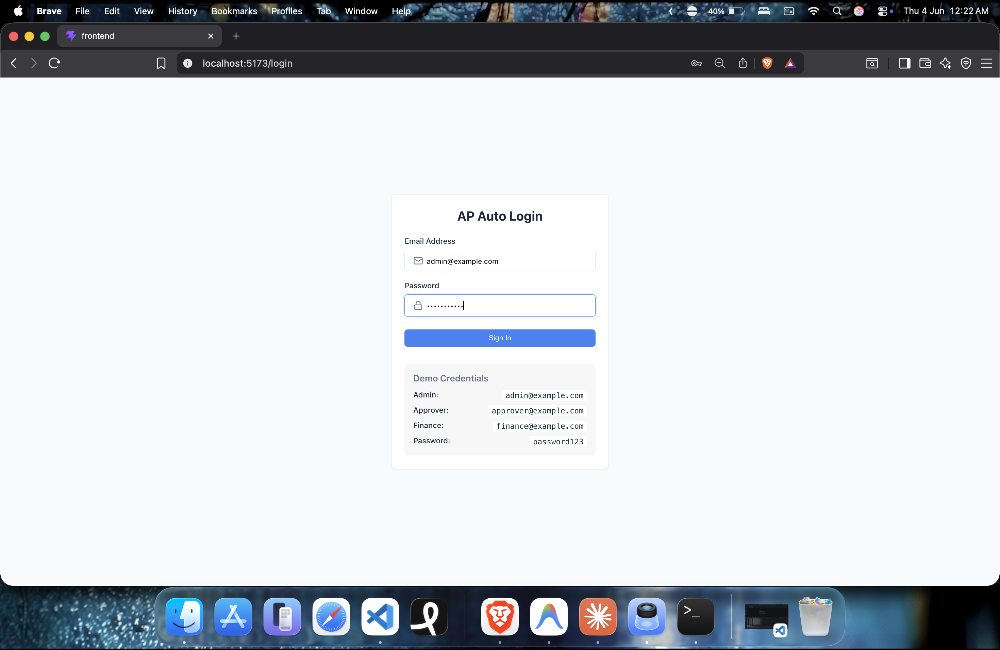
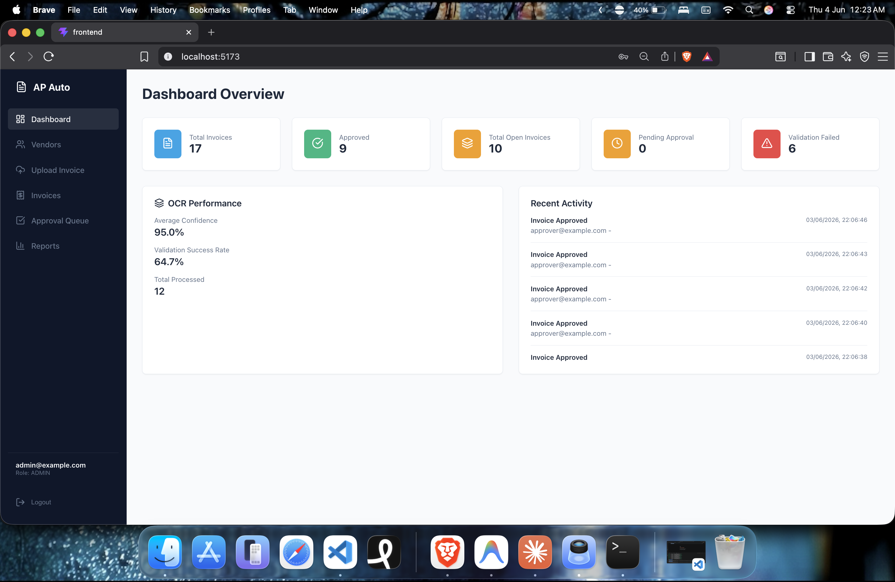
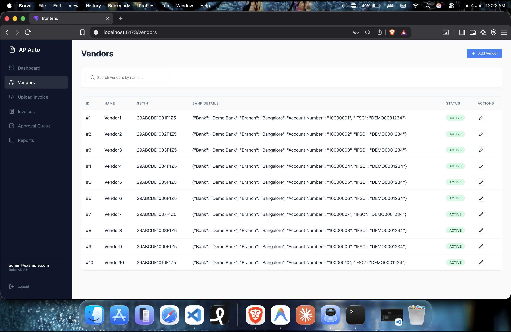
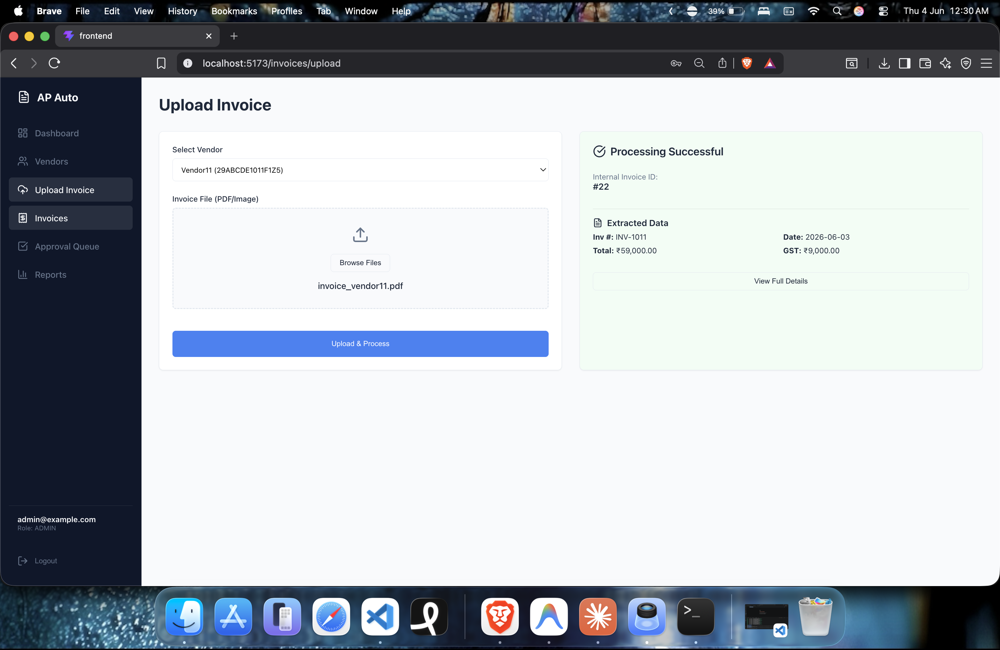
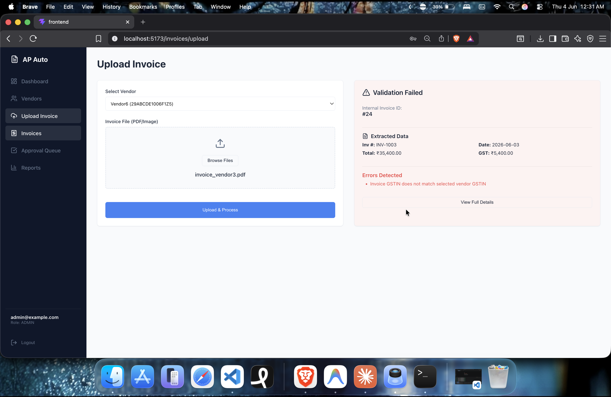
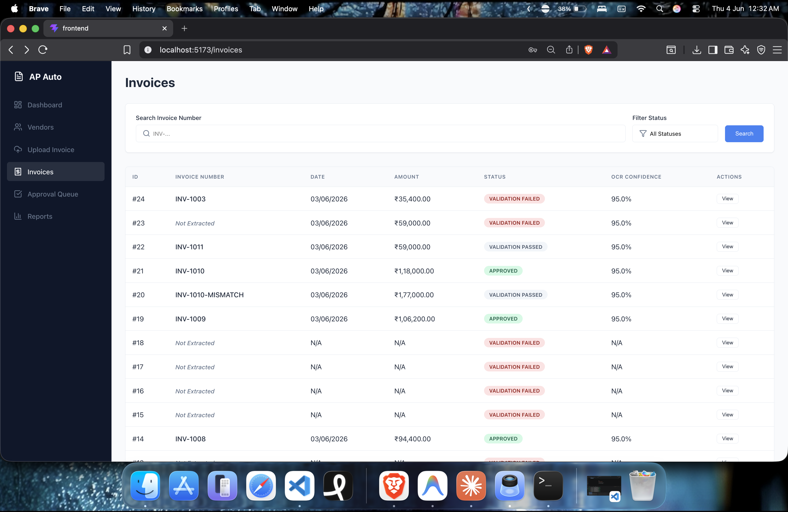
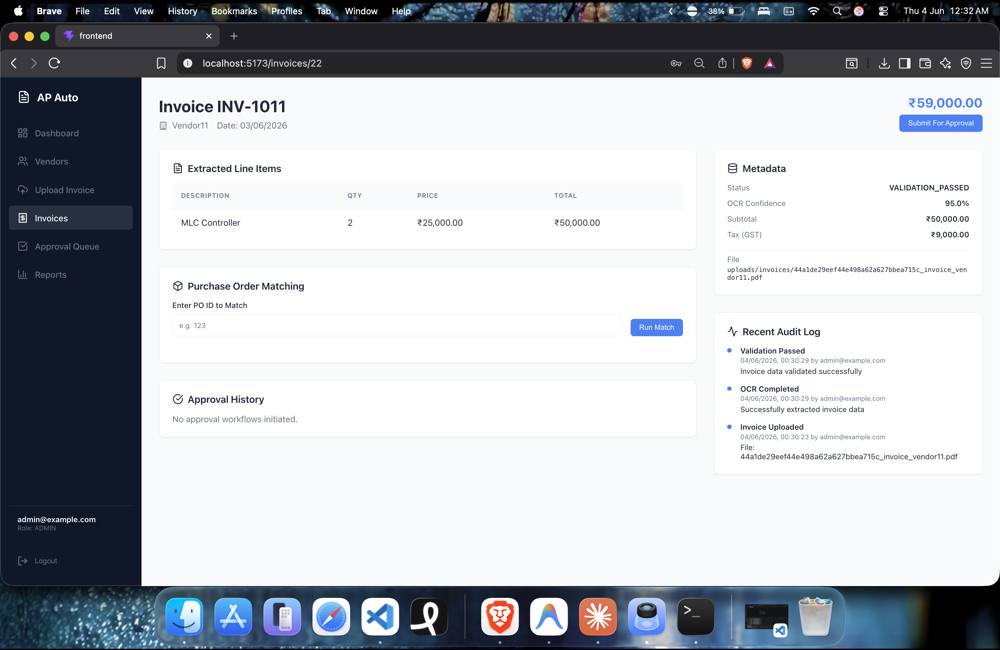
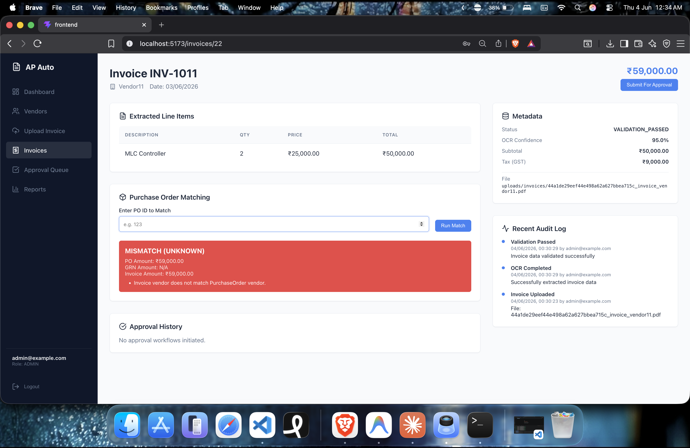
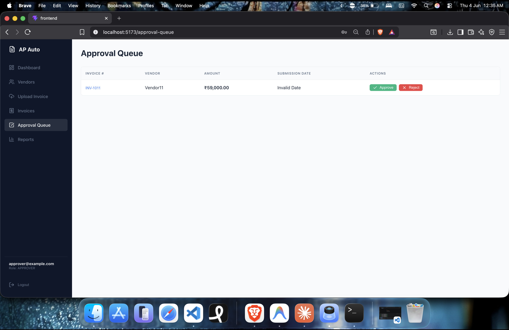
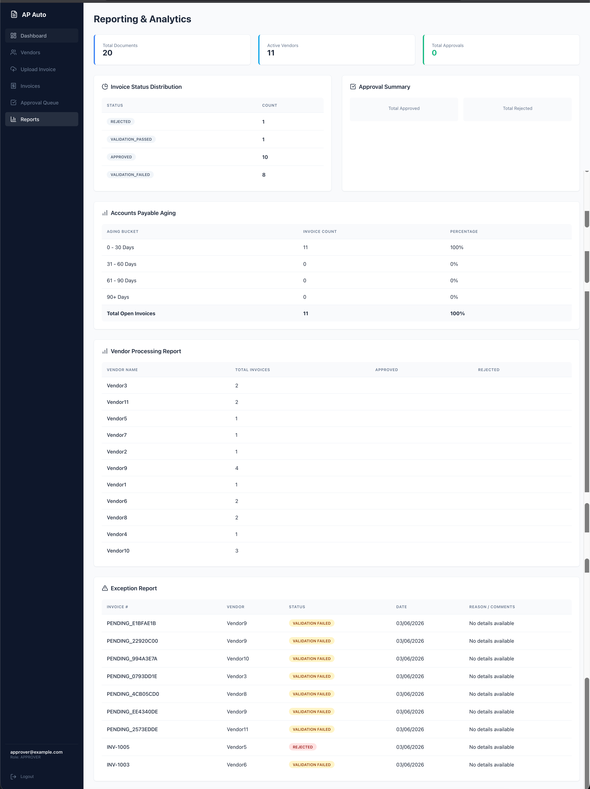

# System Walkthrough & Interactive Demo

This document serves as a complete guided demonstration of the Accounts Payable (AP) Automation System. It illustrates the complete end-to-end lifecycle of an invoice traversing the system—from AI-driven OCR extraction to final manager approval.

---

## 1. Project Introduction

**What is AP Automation?**
Accounts Payable (AP) Automation is the process of digitizing and streamlining the lifecycle of vendor invoices. 

**The Business Problem:**
In traditional finance departments, AP clerks manually transcribe data from PDF invoices into an ERP system. This process is inherently slow, highly susceptible to human error, and lacks visibility. Furthermore, manual verification of line-item prices against Purchase Orders (PO matching) is incredibly tedious. 

**The Solution:**
This system leverages AI (Optical Character Recognition via LLMs) to instantly read and structure invoice data. It enforces rigid validation rules, automates PO matching math, and enforces Role-Based Access Control (RBAC) across a fully audited digital approval queue. The result is a pre-accounting engine that drastically reduces turnaround time and prevents duplicate or fraudulent payments.

---

## 2. Login Page

**Purpose:** Secures the system and identifies the actor for the audit ledger.
**Business Value:** Ensures that only authorized personnel can view sensitive financial data or execute approvals.

**What the User Can Do:**
Users authenticate using OAuth2 JWT credentials. The system employs strict Role-Based Access Control (RBAC) utilizing three primary roles:
*   **ADMIN**: Global system administrator. Can upload and submit invoices, but *cannot* authorize financial approvals.
*   **FINANCE**: AP clerk role. Responsible for uploading invoices, managing vendors, and handling PO matching exceptions. *Cannot* authorize financial approvals.
*   **APPROVER**: Finance Manager or CFO role. Primarily operates out of the Approval Queue to sign off on extracted data.

Upon successful authentication, the user is navigated directly to the Command Center Dashboard.

---

## 3. Dashboard

**Purpose:** Provides a real-time command center of current AP liabilities and operational health.
**Business Value:** Gives management immediate visibility into cash flow bottlenecks (Open Invoices), system efficiency (Validation Failure rates), and overall processing volume.

**What the User Can Do:**
The user can monitor high-level KPI cards, track recent system activity logs, and view processing volume trends. 
*Note: The OCR Confidence metric is currently a 95% placeholder for demonstration purposes, pending true probabilistic scoring logic.*

Next, the finance team must ensure their vendors are properly registered before processing invoices.

---

## 4. Vendor Management

**Purpose:** Maintains the master ledger of authorized suppliers.
**Business Value:** Prevents fraudulent invoices from unapproved, shadow vendors from entering the payment pipeline. 

**What the User Can Do:**
Users can onboard new vendors, manage banking details, and validate GSTINs (tax IDs). Every invoice processed by the system must mathematically tie back to a verified, `ACTIVE` vendor in this ledger. 

With vendors established, the team can begin processing documents.

---

## 5. Invoice Upload

**Purpose:** Ingests raw documents (PDF, PNG, JPG) and converts them into structured data.
**Business Value:** Eliminates manual data entry entirely. 

**What the User Can Do:**
The user selects a registered vendor and utilizes the drag-and-drop interface to upload an invoice file. 

**The Data Flow:**
`Raw File` → `FastAPI Backend` → `Gemini AI / Mistral OCR` → `Structured JSON`

The AI instantly extracts header information (Date, Total, Tax) and granular tabular line items, mapping them to the database schema.

---

## 6. Upload Error Scenario

**Purpose:** Demonstrates the rigid Validation Engine rejecting bad data.
**Business Value:** Safeguards downstream accounting systems from receiving mathematically corrupted or non-compliant data.

**Why this Error Occurs:**
If an uploaded invoice contains structural flaws—such as a missing GSTIN, an unreadable total, or if the math of the line items does not equal the extracted subtotal—the Validation Engine explicitly fails the upload. 

This is a **safeguard**, not a system failure. It prevents corrupted invoices from ever entering the `PENDING_APPROVAL` queue.

---

## 7. Invoice Management

**Purpose:** Provides a centralized, searchable ledger of all ingested invoices.
**Business Value:** Allows the Finance team to track the exact state of every liability.

**What the User Can Do:**
Users can filter and track invoices across their strict lifecycle statuses:
*   `VALIDATION_PASSED`: Extracted successfully and math is correct.
*   `VALIDATION_FAILED`: Extracted, but failed business rules.
*   `PENDING_APPROVAL`: Submitted to management for sign-off.
*   `APPROVED`: Authorized for final ERP payment processing.
*   `REJECTED`: Declined by management.

Users can click into any specific row to view the granular details.

---

## 8. Individual Invoice Detail

**Purpose:** Acts as the single source of truth for an individual invoice.
**Business Value:** Centralizes the extracted data, the original document link, the PO matching status, and the immutable audit log in one view.

**What the User Can Do:**
The user can review the AI-extracted line items, verify tax calculations, examine the approval history ledger, and transition the invoice to the Approval Queue.

Before submitting for approval, the Finance team typically runs a Purchase Order match to prevent overbilling.

---

## 9. Purchase Order Matching

**Purpose:** Mathematically compares the Vendor's bill against the Company's original authorized budget (Purchase Order) and receiving logs (Goods Receipt Notes).
**Business Value:** Prevents vendor overbilling and quantity fraud.

**What the User Can Do:**
The user links the invoice to a specific PO. The system automatically calculates:
*   **2-Way Matching**: `Invoice Amount` vs `Purchase Order Amount`.
*   **3-Way Matching**: `Invoice Amount` vs `Purchase Order Amount` vs `Received Goods Amount`.

**Exception Handling:**
If amounts deviate, the system explicitly flags a `MISMATCH` or `PARTIAL_MATCH`. 
*Note: The mismatch shown in the screenshot is intentional test data used to demonstrate the system's ability to successfully trap and flag mathematical deviations.*

Once PO matching is resolved, the invoice is submitted to the Approval Queue.

---

## 10. Approval Workflow

**Purpose:** Provides a unified inbox for managers to sign off on corporate spending.
**Business Value:** Enforces accountability, prevents unauthorized payments, and maintains compliance.

**How RBAC Affects the Workflow:**
This queue strictly enforces RBAC. 
*   If an `ADMIN` or `FINANCE` user attempts to approve an invoice, the UI explicitly disables the action buttons and displays an "Access Restricted" evaluator hint.
*   Only accounts utilizing the `APPROVER` role may execute decisions here.

**What the User Can Do:**
An authorized `APPROVER` reviews the PO matches and line items, then utilizes the focus-trapped modal to digitally **Approve** or **Reject** the invoice. The system enforces mandatory comments for these actions, guaranteeing context is preserved in the audit logs.

---

## 11. Reports & Analytics

**Purpose:** Aggregates transactional data into strategic insights.
**Business Value:** Allows the treasury department to forecast cash flow and identify operational bottlenecks.

**Available Analytics:**
*   **Invoice Status Pipeline**: Visualizes the volume of invoices sitting at each lifecycle stage.
*   **AP Aging Report**: Groups unpaid liabilities into 30/60/90+ day buckets, critical for managing working capital and avoiding late fees.
*   **Exception Reports**: Details specific rejection reasons and validation failure trends to help identify problematic vendors.

---

## 12. End-to-End Workflow Summary

The system orchestrates the following highly efficient pipeline, drastically reducing manual AP effort:

**Vendor Master Setup** 
↓
**Invoice Upload (PDF/Image)** 
↓
**AI OCR Extraction (Zero Data Entry)** 
↓
**Rigid Mathematical Validation** 
↓
**Automated PO Matching (Fraud Prevention)** 
↓
**RBAC Approval Routing** 
↓
**Immutable Audit Logging** 
↓
**Financial Reporting & Aging Analytics**

---

## 13. Known Demo Limitations

While fully functional as a robust pre-accounting engine, the current MVP has the following known architectural limits:
*   **Payment Processing**: The workflow natively halts at the `APPROVED` state. Integration with corporate banking APIs (e.g., Stripe Treasury, RazorpayX) or ERP batch file generation is deferred to Phase 2.
*   **Dynamic Routing**: The approval queue utilizes a linear, single-tier workflow. Multi-tier threshold routing (e.g., routing invoices > ₹50,000 to the CFO) requires manual intervention.
*   **Ingestion Limits**: Currently, invoices must be manually uploaded via the web UI. Automated IMAP inbox scraping for bulk ingestion is not yet implemented.

---

## 14. Conclusion

This Accounts Payable Automation System successfully demonstrates the viability of modernizing legacy finance operations. By leveraging **AI-driven OCR**, the system eliminates tedious manual data entry. By enforcing **deterministic mathematical validation and automated PO matching**, it prevents financial leakage and vendor fraud. Finally, by wrapping the entire pipeline in **strict Role-Based Access Control and immutable Audit Logging**, the system provides a highly reliable, auditable, and operationally efficient pre-accounting pipeline ready for enterprise deployment.
